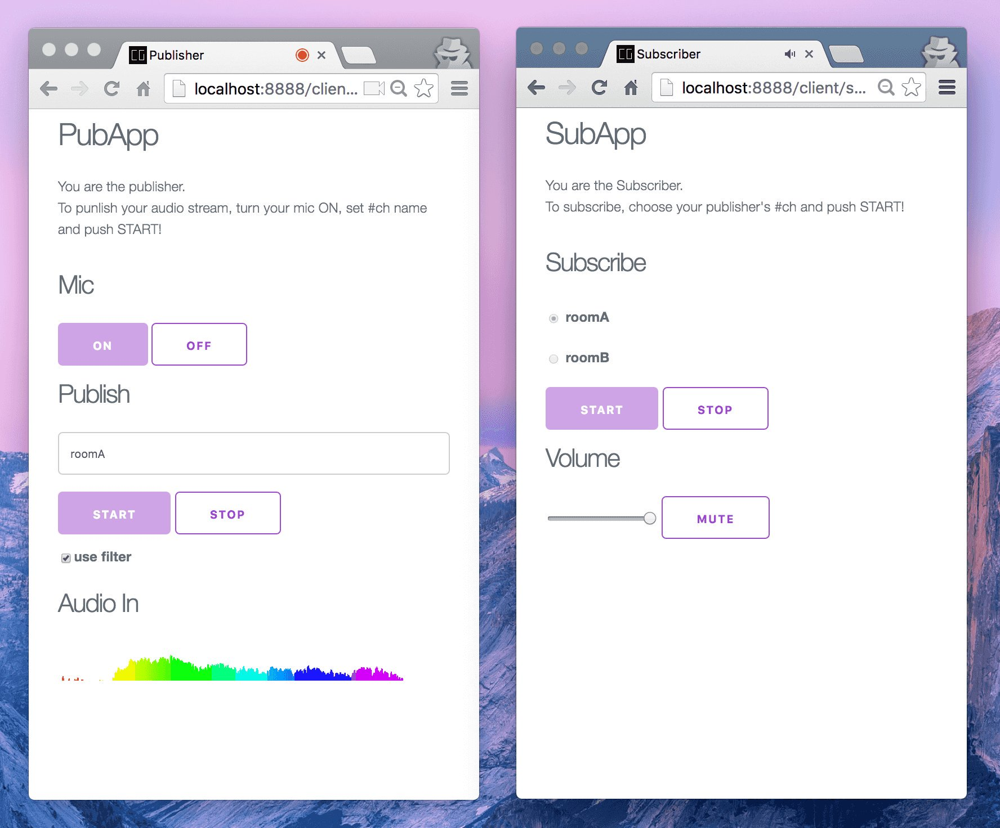

# audio-streaming-over-websocket
株式会社ピクセルグリッド 2016春の開発合宿 in 八丈島での成果物。

## 作ってみての学び
http://leader22.github.io/slides/asows/

## 試すなら
### サーバー
- git clone
- npm start

wsが通るようにする(デフォルトは9999ポート)

### クライアント
- git clone
- [コレ](https://github.com/leader22/audio-streaming-over-websocket/blob/master/client/_src/script/cmn/const.js#L2)を、↑のサーバーのアドレスに書き換え
- npm run build
- ローカルにサーバー立てて、`/client/pub/`や`/client/sub/`にアクセス

Pub: localhost ⇔ サーバー ⇔ Sub: localhost が一番簡単

### Memo
- `/client/pub/`や`/client/sub/`にアクセスしたときにページを返すサーバーは実装してない
- HTTPSかlocalhostでないと、Pubできないので注意
- Subもサーバーに置くならビルドして

- - -

## やりたかったこと
- iOSのモバイル端末Aで、別のPC端末Bで鳴ってる音を流したい
- イカデンワとかSkypeとか、PCで鳴ってる音をそのまま聴く専のクライアントが欲しい
- WebRTCはもちろん使えないが、WebSocketが使えるならなんとかなるのでは！
  - Binaryで送るとかMediaRecorderでファイルにして送るとかなんとかできないか
- これでiOSが拾えるだけでもすごい裾野が広がると思うけどどうですかね

## 調べる
- 先人の資料を読む
  - https://subvisual.co/blog/posts/39-tutorial-html-audio-capture-streaming-to-node-js-no-browser-extensions
  - https://blog.agektmr.com/2012/03/websocket.html
    - https://github.com/agektmr/AudioStreamer
  - http://blog.livedoor.jp/kotesaki/archives/1544696.html
  - https://github.com/scottstensland/websockets-streaming-audio
  - https://github.com/binaryjs/binaryjs
  - https://github.com/muaz-khan/WebRTC-Experiment/tree/master/RecordRTC
- やり方は2つありそう
  - その場で音を録音して、それをバイナリとして送る
  - そのまま送る
- と思ったけど1つ(詳細で2つ)しかなさそう
  - MediaRecorderでwebmにしてそれを送る
   - https://github.com/mganeko/wmls/blob/master/views/golive.ejs
   - audioOnProcessでバッファを送る
   - AudioBufferをそのまま？もしくは中のデータをint16にしてそれぞれ？
